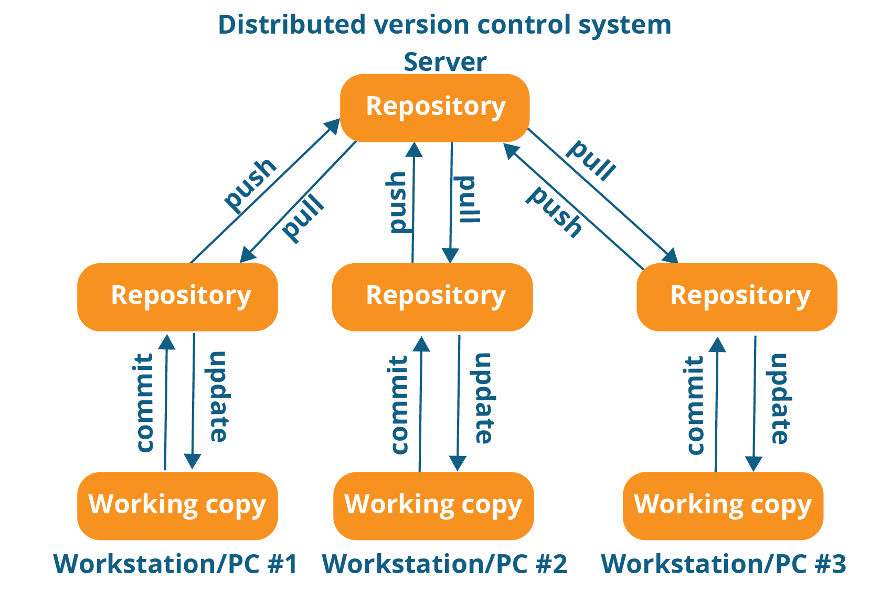

# Summary

# What is Version Control and why use it?
  ○ A practice of tracking and managing code changes over time.
  ○ It allows people to work on code, and make it easy to merge their work together
  ○ It allows the comparison of different versions to more easily identify changes
  ○ It allows the creation of named versions of code so that they can be released 
  ○ Helps support parallel development work

# What is GIT
GIT is a free, open-source distributed version control system that allows users to track changes and versions of code. 

This schematic illustrates the general structure of GIT. It tracks changes done in each developers local environment, and then facilitates the merging and updating of code changes across the network of users for that particular repository of code.

GIT's system creates an index tree of code versions such that users can switch between them and change their local code base to whatever version of the code base they wish.

# What is GITHUB
At a fundamental level, GitHUB is a platform that hosts code version-controlled through Git that allows for collaboration across users. Through storing your own code on it, it is also an opportunity to showcase your own experience and contribute to your professional brand. You can also use it to host a professional website or automate running reoccurring code (through GitHUB Actions). Because of its prevalence in the data science and coding community, you can also use it to view other people's code and communicate with the authors of code packages you use about issues or questions.  

# Set up GIT

# Set up GITHUB

# Example
